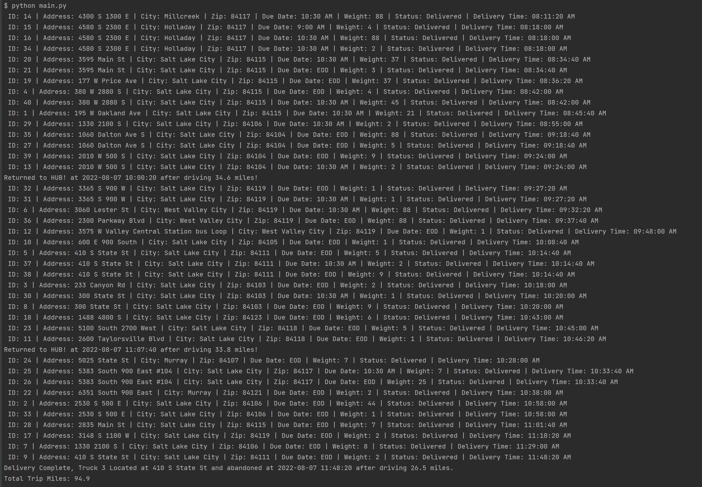
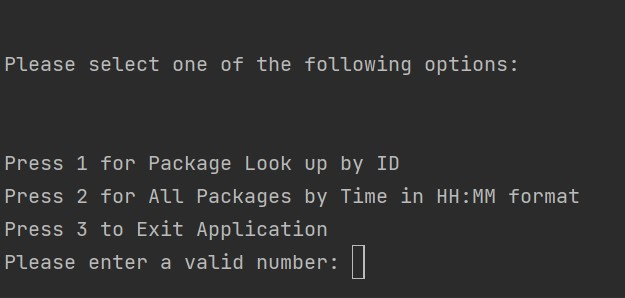

# Routing Algorithm

## Description

Project for Data Structures and Algorithms 2 at Western Governors University

Scenario: 

The Western Governors University Parcel Service (WGUPS) needs to determine the best route and delivery distribution for their
Daily Local Deliveries. The Salt Lake City DLD route has three trucks, two drivers, and an average of 40 packages to deliver each
day; each package has specific criteria and delivery requirements.

Your task is to write code that determines and presents a solution delivering all 40 packages, listed in the attached “WGUPS
Package File,” on time, according to their criteria while reducing the total number of miles traveled by the trucks. The “Salt Lake
City Downtown Map” provides each address’s location, and the “WGUPS Distance Table” provides the distance between each
address (note: mileage on the distance files may not match distances on the map).

The supervisor (user) needs the means to check the status of any given package at any given time using package IDs. The report
should also include the delivery times, which packages are at the hub, and en route. The intent is to use this program for this specific
location and use the same program in different cities as WGUPS expands its business. As such, you will need to include detailed
comments following the industry-standards to make your code easy to read and justifying the decisions you made while writing
your program.

## Table of Contents (Optional)

If your README is long, add a table of contents to make it easy for users to find what they need.

- [Installation](#installation)
- [Usage](#usage)
- [Credits](#credits)
- [License](#license)

## Installation

All standard Python Library code. No expected installs

## Usage

To run code ```python main.py``` in terminal

A CLI menu will appear

    
## Credits

Roger Le

WGU ID # 1060770

Email: rle12@wgu.edu

## License


---
## Badges


## Features

Command Line Interface Driven Application

Will deliver 40 packages all over Salt Lake City

Select Options from the Menu Displayed


